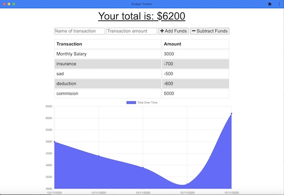

# Offline Budget Trackers


  
  
  
  

  
  
  
  
  
  
  
  

 
  
  
  # Description 
📝
This is a Budget Tracker application to allow for offline access and functionality.
The user will be able to add expenses and deposits to their budget with or without a connection. When entering transactions offline, they should populate the total when brought back online.

Offline Functionality:


Enter deposits offline


Enter expenses offline


When brought back online:

Offline entries should be added to tracker.
 

  # Table of Contents
  - [Description](#description)
  - [Usage](#usage)
  - [Installation](#installation)
  - [License](#License)
  - [Links](#links)

# Acceptance Criteria
```

GIVEN a user is on Budget App without an internet connection
WHEN the user inputs a withdrawal or deposit
THEN that will be shown on the page, and added to their transaction 
history when their connection is back online.

```
# User Story 👩🏻‍💻

AS AN avid traveller
I WANT to be able to track my withdrawals and deposits with or without a data/internet connection
SO THAT my account balance is accurate when I am traveling

# Business Context
Giving users a fast and easy way to track their money is important, but allowing them to access that information anytime is even more important. Having offline functionality is paramount to our applications success.

# Usage
💻 Open [Heroku](https://offline-available-badgetapp.herokuapp.com/) link, enter the transaction name and amount, and click Add or Subtract.
This application works both online and offline. If you enter a transaction offline, the transaction is saved and will continue to exist when you come back online.
You can also install a manifest to run the application offline.
To run this app via VS code, run <code>npm start</code>, and go http://localhost:3000.

;


# Installation 
🗳 
<code>Node.js</code>,<code>npm install</code>,<code>npm install express</code>,<code> npm install start</code>,<code>npm install seed</code>,<code>npm install mongoose</code>,<code>npm install morgan</code>,<code>npm install life-server</code>,<code>npm install compression</code>
  
# License 
✅ MIT
# Links
:atom_symbol: [Heroku](https://offline-available-badgetapp.herokuapp.com/)<br />
:octocat: Github [Repo](https://github.com/jmorris107/Offline-Budget-Trackers.github.io) / [Account](https://github.com/)<br />
<br />
  